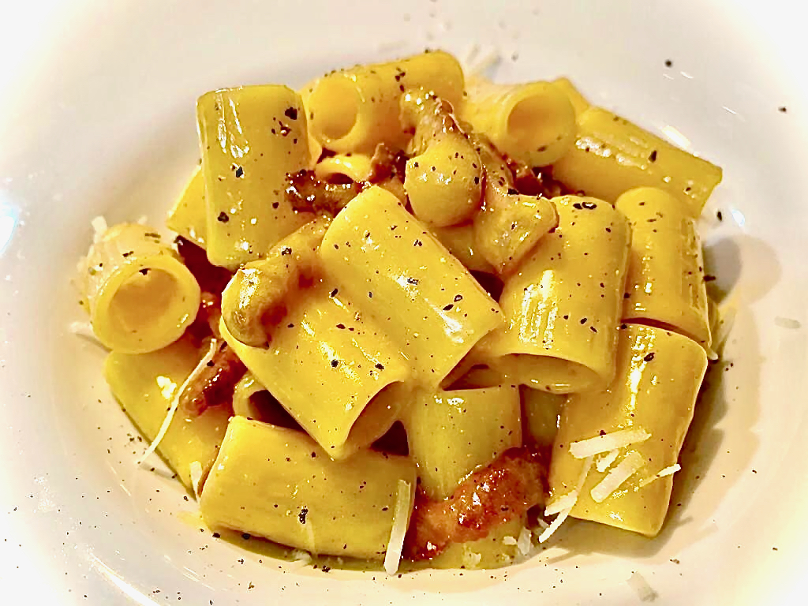

# Mezze maniche alla carbonara

<!-- Prof guardi che ho usato la sintassi HTML anzichè quella di Markdown perchè l'immagine risultava troppo grande -->

>⏰ ~20 minuti
>
>👨‍🍳 Facile
>
>🧑🏻‍🤝‍🧑🏻 4 persone

*Quando la più famosa ricetta romana incontra la
pasta più autenticamente napoletana, è impossibile
resistere alla tentazione.*

## Ingredienti

- 400 g di Mezze Maniche Rigate
- Voiello n. 122
- 200 g Pecorino
- 5 tuorli d’uovo
- 280 g guanciale
- Pepe nero q.b.

## Preparazione

Eliminare la cotenna del guanciale, tagliare a
listarelle spesse circa mezzo centimetro. Lasciare
sfrigolare in una padella a fuoco moderato finché la
parte grassa diventa trasparente. Versare il grasso
in una ciotola e rimettere il guanciale sul fuoco per
renderlo croccante. Spegnere la fiamma e mettere
da parte il guanciale.

In una scodella amalgamare brevemente con una
spatola i tuorli, unire il pepe e il pecorino
(tenendone da parte due cucchiai). Aggiungere 2
cucchiai di grasso del guanciale per rendere il
composto vellutato.

Nel frattempo cuocere le Mezze Maniche Rigate
Voiello usando circa la metà del sale adoperato
abitualmente (il pecorino è piuttosto saporito).
Mettere da parte un po’ d’acqua di cottura e scolare
al dente.

Versare le Mezze Maniche Rigate nella padella del
guanciale. Unire la crema di tuorli e pecorino
insieme a un mestolo scarso d’acqua di cottura.
Mescolare per amalgamare il tutto fino a
raggiungere una consistenza cremosa. Aggiungere
una spolverata di pecorino e servire.
